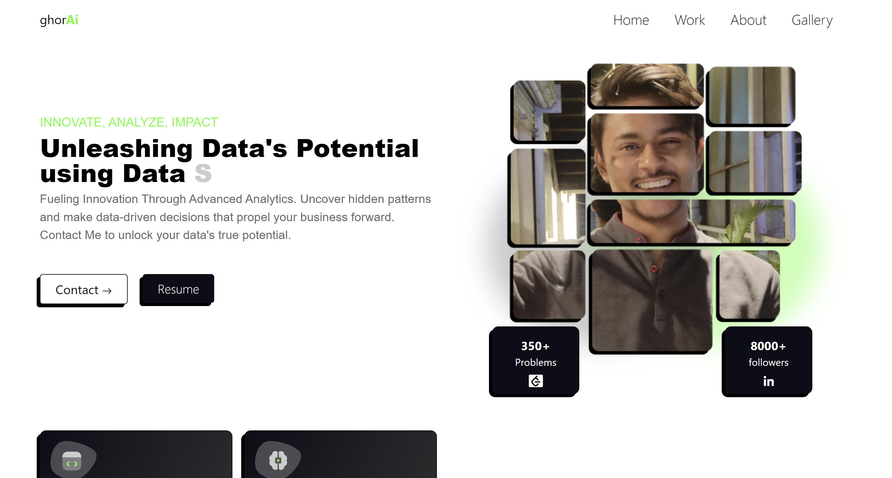

# Soumyadip Ghorai's Portfolio 2.0 🚀

Welcome to my personal portfolio repository! This portfolio is created using HTML, CSS, Bootstrap, SCSS, and JS. It's deployed on GitHub Pages and can be accessed [here](https://soumyadipghorai.github.io/portfolio-2.0).

## Project Structure

- **.github/workflows:** Contains GitHub Actions workflows for automating tasks.
- **css:** Stylesheets for the portfolio.
- **docs:** Deployment folder for GitHub Pages.
- **images:** Images used in the portfolio.
- **js:** JavaScript files for interactive elements.
- **scss:** SCSS files for styling.
- **.gitignore:** Specifies intentionally untracked files to ignore.
- **README.md:** You are here!
- **index.html:** The main HTML file for the portfolio.
- **task.txt:** A file containing tasks or notes related to the project.

## Features

- Responsive design using Bootstrap.
- Interactive elements powered by JavaScript.
- Stylish and modern layout with SCSS.

## Deployment

The portfolio is automatically deployed to GitHub Pages on each push to the `main` branch.

## Acknowledgments

Feel free to use this portfolio as inspiration for your own projects. Don't forget to give credit if you find it helpful!

If you have any questions or suggestions, feel free to reach out.

Happy coding! 🚀
